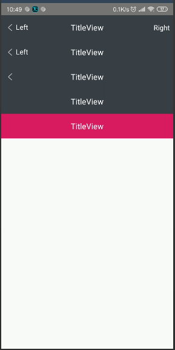

### TitleView

快速实现标题栏。


### 添加 `TitleView` 到项目

- 第一步： 添加 `JitPack` 到项目的根 `build.gradle` 中


```gradle
allprojects {
    repositories {
        ...
        maven { url 'https://jitpack.io' }
    }
}
```

- 第二步：添加库依赖


```gradle
dependencies {
    implementation 'com.github.huangziye:TitleView:${latest_version}'
}
```


```xml
<?xml version="1.0" encoding="utf-8"?>
<LinearLayout
        xmlns:android="http://schemas.android.com/apk/res/android"
        xmlns:tools="http://schemas.android.com/tools"
        xmlns:app="http://schemas.android.com/apk/res-auto"
        android:layout_width="match_parent"
        android:layout_height="match_parent"
        android:orientation="vertical"
        tools:context=".MainActivity">

    <com.hzy.title.TitleView
            android:layout_width="match_parent"
            android:layout_height="?attr/actionBarSize"
            app:leftText="Left"
            app:titleText="@string/app_name"
            app:rightText="Right"
            app:titleTextColor="@android:color/white"
            app:leftTextColor="@android:color/white"
            app:rightTextColor="@android:color/white"
            app:leftTextSize="16dp"
            app:rightTextSize="16dp"
            app:titleTextSize="18dp"
            app:leftDrawable="@mipmap/ic_back"
            app:leftMarginLeft="0dp"
            app:leftMarginRight="0dp"
            app:rightMarginLeft="0dp"
            app:rightMarginRight="0dp"/>
    <com.hzy.title.TitleView
            android:layout_width="match_parent"
            android:layout_height="?attr/actionBarSize"
            app:leftText="Left"
            app:titleText="@string/app_name"
            app:rightText=""
            app:titleTextColor="@android:color/white"
            app:leftTextColor="@android:color/white"
            app:rightTextColor="@android:color/white"
            app:leftTextSize="16dp"
            app:rightTextSize="16dp"
            app:titleTextSize="18dp"
            app:leftDrawable="@mipmap/ic_back"/>
    <com.hzy.title.TitleView
            android:layout_width="match_parent"
            android:layout_height="?attr/actionBarSize"
            app:leftText=""
            app:titleText="@string/app_name"
            app:rightText=""
            app:titleTextColor="@android:color/white"
            app:leftTextColor="@android:color/white"
            app:rightTextColor="@android:color/white"
            app:leftTextSize="16dp"
            app:rightTextSize="16dp"
            app:titleTextSize="18dp"
            app:leftDrawable="@mipmap/ic_back"/>
    <com.hzy.title.TitleView
            android:layout_width="match_parent"
            android:layout_height="?attr/actionBarSize"
            app:leftText=""
            app:titleText="@string/app_name"
            app:rightText=""
            app:titleTextColor="@android:color/white"
            app:leftTextColor="@android:color/white"
            app:rightTextColor="@android:color/white"
            app:leftTextSize="16dp"
            app:rightTextSize="16dp"
            app:titleTextSize="18dp"/>
    <com.hzy.title.TitleView
            android:layout_width="match_parent"
            android:layout_height="?attr/actionBarSize"
            app:leftText=""
            app:titleText="@string/app_name"
            app:rightText=""
            app:titleTextColor="@android:color/white"
            app:leftTextColor="@android:color/white"
            app:rightTextColor="@android:color/white"
            app:titleViewBgColor="@color/colorAccent"
            app:leftTextSize="16dp"
            app:rightTextSize="16dp"
            app:titleTextSize="18dp"/>

</LinearLayout>
```


### 预览图




<br />

### 关于我


- [简书](https://user-gold-cdn.xitu.io/2018/7/26/164d5709442f7342)

- [掘金](https://juejin.im/user/5ad93382518825671547306b)

- [Github](https://github.com/huangziye)

<br />

### License

```
Copyright 2018, huangziye

   Licensed under the Apache License, Version 2.0 (the "License");
   you may not use this file except in compliance with the License.
   You may obtain a copy of the License at

       http://www.apache.org/licenses/LICENSE-2.0

   Unless required by applicable law or agreed to in writing, software
   distributed under the License is distributed on an "AS IS" BASIS,
   WITHOUT WARRANTIES OR CONDITIONS OF ANY KIND, either express or implied.
   See the License for the specific language governing permissions and
   limitations under the License.
```